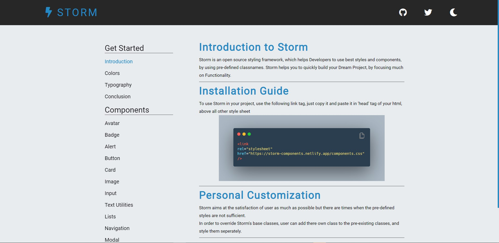

## Quick Start

To start using the components in your project, Copy-paste the stylesheet `<link>` into your `<head>` before all other stylesheets to load our CSS.

```html
    <link
    rel="stylesheet"
    href="https://storm-components.netlify.app/components.css"
    />
```   

### Posh UI contains the following components

- [Avatar](#Avatar)
- [Badge](#Badge)
- [Alert](#Alert)
- [Button](#button)
- [Card](#card)
- [Image](#image)
- [Input](#input)

### Avatar

Avatars can be used for user profile picture.

You will find the following types of *Avatar* on https://storm-ui.netlify.app/components/avatar/avatar

- Profile Avatar
- Sized Avatar
- Square Avatar

---


### Badge

Badge can be used to show either status of the user (online, or offline) or you can use it show notification count.

You will find the following types of *Badge* on https://storm-ui.netlify.app/components/badge/badge

- Profile Badge V1
- Profile Badge V2
- Icon Badge

---

### Alert

Alerts can be used to show a message to the user.

You will find the following types of *Alert* on https://storm-ui.netlify.app/components/alert/alert

- Simple Alert
- Outline Alert

---

### Button

Buttons can be used to make your web page interactive to your user. You can use them to take user action.

You will find the following types of *Button* on https://storm-ui.netlify.app/components/button/button

- Contained Button
- Outline Button
- Link Button
- Icon Button
- Floating Action Button

---

### Card

Cards can be proved very useful. You can use them to display content on an e-commerce app, or on a video library app. You can also use them to show user feedback in the form of text-only card on your site.

You will find the following types of *Card* on https://storm-ui.netlify.app/components/card/card

- Card with Badge
- Card with Dismiss
- Card with Text Overlay
- Text only Card
- Horizontal / Vertical Cards
- Card with Shadow
- Ecommerce Card

---

### Image

Image can be used to display large picture on the website.

You will find the following types of *Image* on https://storm-ui.netlify.app/components/image/image

- Square Image
- Round Image
- Responsive Image

---

### Input

Input can be used to take input from your user. It can make your site more interactive.

You will find the following types of *Input* on https://storm-ui.netlify.app/components/input/input

- Label Input
- Placeholder Input

---

## 👨‍💻 Connect with me

<a href="https://twitter.com/TheBestDhruv"></a>
<a href="https://www.linkedin.com/in/dhruv-samant-4a527b218/"></a>

---



---

<div align="center">

Have a look at the implementation of [Storm UI Components](https://github.com/b0llu/storm-components/tree/developer).

</div>